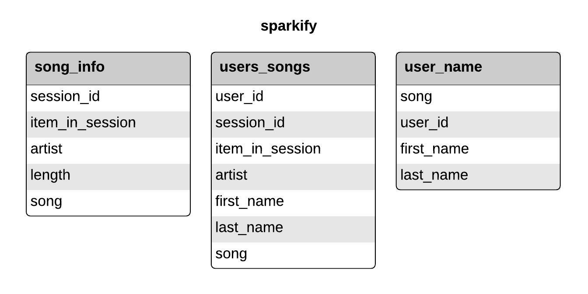

## Project Purpose and Description

Sparkify (fake company) is back at it again and wants to continue to analyze the data they've been collecting on music and user activity on a new music streaming app.  This time, the data team is interested in specific queries.  Sparkify wants to create a NoSQL Database using Apache Cassandra to optimize for fast reads and writes.  In this project, I created a keyspace with tables to answer simple query questions.  

## Tools (all using Python and its various libraries)
   - Pandas
   - Apache Cassandra
   
## Data

The data is in the form of csv files where they will all be processed by a function that will create tables and insert data.  

### CSV File Foramt

   `2018-11-01-events.csv`

## Table Goals
 
Since joins are not optimized for NoSQL Databases, 3 Seperate tables will answer 3 different queries.  

##  Queries

1) Give me the artist, song title and song's length in the music app history that was heard during sessionId = 338, and itemInSession = 4

`SELECT artist, song_title, song_length 
FROM song_details
WHERE session_id = 338 AND item_in_session = 4;`

2) Give me only the following: name of artist, song (sorted by itemInSession) and user (first and last name) for userid = 10, sessionid = 182

`SELECT artist_name, song_title, user_first_name, user_last_name
FROM artist_details
WHERE user_id = 10 AND session_id = 182;`

3) Give me every user name (first and last) in my music app history who listened to the song 'All Hands Against His Own'

`SELECT user_first_name, user_last_name 
FROM user_details 
WHERE song_title = 'All Hands Against His Own';`

## Repo Files

**Project_1B.ipynb** - Running this notebook iterates through each event file in event data to procress and creates a new CSV file.  This file also creates denormalized tables and runs Sparkify's queries.

**event_datafile_new.csv** -  This file contains a clean CSV ready for tables creation.  

### Many thanks to [Marco Sanchez Ayala](https://github.com/msanchez-ayala) for the Sparkify tables image!
